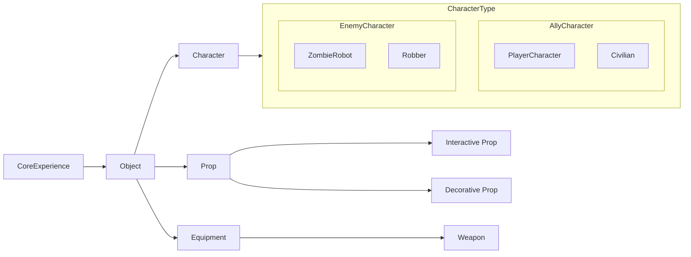

```mermaid
graph LR;

%%Node definition%%
CoreExperience[CoreExperience];
Object[Object];
Character[Character];
Prop[Prop];
InteractiveProp[Interactive Prop];
DecorativeProp[Decorative Prop];
Equipment[Equipment];
Weapon[Weapon];

PlayerCharacter[PlayerCharacter];
Civilian[Civilian];
ZombieRobot[ZombieRobot];
Robber[Robber];

%%Node link and class%%
click CoreExperience "/Design/Mechanic/CoreExperience";
class CoreExperience internal-link;

%%Node flow%%
CoreExperience --> Object;
Object --> Character;
Object --> Prop;
Object --> Equipment;
Prop --> InteractiveProp;
Prop --> DecorativeProp;
Equipment --> Weapon;

Character --> CharacterType;
subgraph AllyCharacter;
direction TB;
PlayerCharacter;
Civilian;
end;

subgraph EnemyCharacter;
direction TB;
ZombieRobot;
Robber;
end;

subgraph CharacterType;
direction TB;
AllyCharacter;
EnemyCharacter;
end;

```
