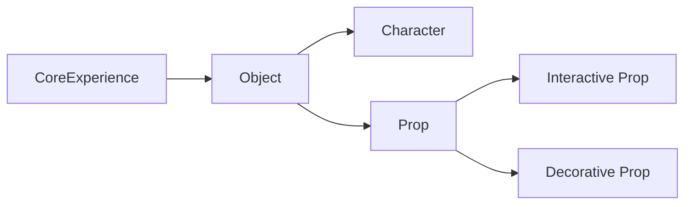

```mermaid
graph LR;

%%Node definition%%
CoreExperience[CoreExperience];
Object[Object];
Character[Character];
Prop[Prop];
InteractiveProp[Interactive Prop];
DecorativeProp[Decorative Prop];

%%Node link and class%%
click CoreExperience "/Design/Mechanic/CoreExperience";
class CoreExperience internal-link;

%%Node flow%%
CoreExperience --> Object;
Object --> Character;
Object --> Prop;
Prop --> InteractiveProp;
Prop --> DecorativeProp;

```
